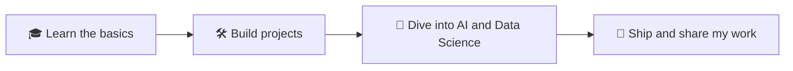

<!-- ================= BANNER ================= -->

  

<!-- ================= TYPING ANIMATION ================= -->

  

<!-- ================= BADGES ================= -->

  
  
  

  

---

## 👋 About Me

I'm a 3rd year **B.Tech student in Computer Science (AI & Data Science)**. I learn best by building real things, so I'm putting my projects and progress here as I go.

- 🎓 B.Tech CSE (AI & Data Science), 3rd year
- 🛠️ Excited to build real projects and learn by doing
- 🤖 Interested in **AI** and **Data Science**
- 📫 Let's connect and learn together!

---

## 🛠️ Tech Stack

**Languages**

  

**Frameworks and Tools**

  

**Deployment**

  

---

## 🚀 Projects

<table>
  <tr>
    <td>
      <h3>✨ Next project coming soon</h3>
      
I'm working on my next project. When it's ready, it will be featured here with a link to the code.

      

        
      

    </td>
  </tr>
</table>

---

## 🗺️ My Journey

---

## 📊 GitHub Stats

  
  

  

> The stats start small and grow as I commit more code.

---

## 🌐 Connect With Me

  
  
  

<i>⭐ Thanks for stopping by. Let's build something great.</i>

